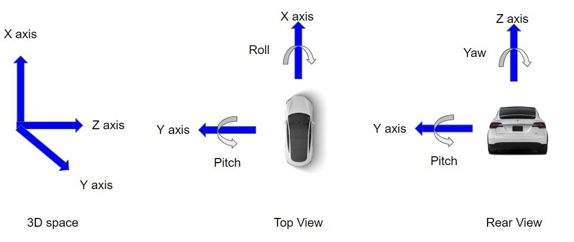

### kaggle-pku

Team repo. for PKU Autnomous Driving Kaggle Competition.

#### To run the code
1. If you are training locally `Do python train_model.py `
2. If you are using the SSC cluster do `qsub scripts/qsub_job.template.sh`

#### Visualize train/val loss graph
```
cd kaggle-pku/
tensorboard --logdir runs/ --port 4999
```
Check out result on your browser [http://[ip_host]:4999]()

#### Code explained -
1. This code uses [CenterNet](https://arxiv.org/pdf/1904.07850.pdf) to draw 3D bounding boxes for objects
2. 

#### Task
3D vehicle 6-DOF pose estimation.

- The quantities to be estimated are:
    * X, Y, Z co-ordinates
    * Roll, Pitch, Yaw 

- Note : 
1. Code has beed tested for only GPU environments
2. Takes at least 16GB of GPU memory
